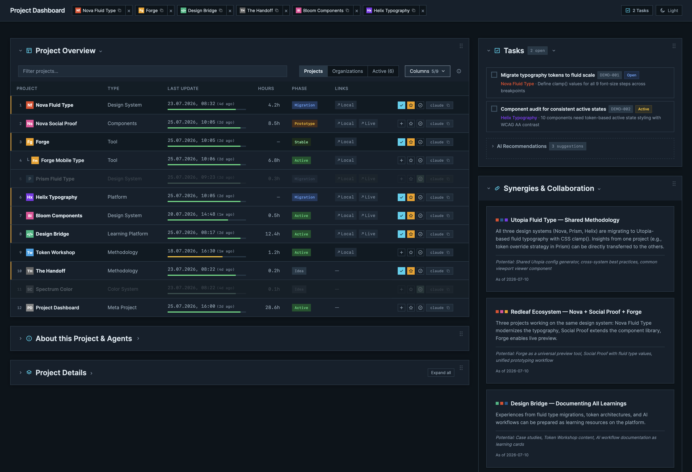

# Project Dashboard

I've been managing a few design system projects at the same time and kept losing track of what's where. I opened Claude Code and started building a dashboard. Just a single HTML file, nothing fancy.

First it was only a table with project names and some numbers. But then I wanted to sort it. Then I wanted search. Project cards came next, then docs tables, then task management. At some point the dashboard started tracking my hours from Claude Code session logs, grew a sidebar for tasks and synergies, and learned drag & drop so I could arrange it the way I think.

Somewhere along the way I realized I was learning more about Claude Code than about dashboards. What works, what doesn't, how to structure things so the AI can actually help you. I ended up building three AI agents that now keep the dashboard up to date: a scanner collects the numbers in seconds, a bridge finds connections between projects, and a coordinator orchestrates both.

The whole thing is still a single HTML file with zero dependencies — no build step, no framework, no server. Open it in a browser and it works. Every feature you see was built in conversation with Claude Code, and the `CLAUDE.md` in this repo is the actual instruction set that makes the AI understand and maintain it.

If you're a designer trying to get into Claude Code and looking to understand better code and developers, fork it, swap in your own projects, and go from there. The demo you're looking at ships with twelve fictional projects so you can click through every feature before wiring up your own.



## Features

**Overview table**

- Sortable, filterable project table with full text search and hit counter
- Grouped by organization with section sub-headings — sorting by a column switches to a flat global ranking
- Three view modes: **Projects** (flat), **Organizations** (grouped), **Active** (starred only)
- Sub-projects shown as indented sub-rows that stay attached to their parent
- Freshness bar per project — green when recently updated, red (and short) when stale
- Column visibility toggle — show/hide columns, persisted in localStorage

**Organize your work**

- Sticky header with **quicklink pills** — pin favorite projects, drag to reorder, click to copy the launch command
- Star projects as "in progress", mark projects as completed (dims the row and deactivates their tasks)
- Drag & drop everywhere — reorder sections and table rows, persisted in localStorage
- Task management with status tracking, plus AI-generated task recommendations
- Keyboard shortcuts: `/` search, `t` theme, `a` tasks, `1`/`2`/`3` view modes

**Project knowledge**

- Expandable project cards (with collapse/expand all)
- Docs tables per project (research, project, code, Claude files)
- Synergy cards — connections and transfer opportunities between projects
- Idea cards for early-stage concepts

**Time tracking**

- Hours per project via `time-log.md` — manual entries plus Claude session hours computed from `.jsonl` logs
- Hours column, Σ total, and per-card time-log breakdowns

**AI tooling**

- Three AI agents (scanner, bridge, coordinator) — the dashboard maintains itself via Claude Code
- Shell script that scans all projects, updates time logs, collects tasks, and checks for dead links
- Self-bootstrapping: `CLAUDE.md` contains everything the AI needs to set up and maintain your dashboard

**Architecture**

- Single HTML file, zero dependencies, no build step — works offline
- Two-column layout: main column + sticky sidebar (tasks & synergies)
- Dark/light theme, auto-generated color-coded favicons per project
- Footer with live stats (projects, organizations, in progress, open tasks, hours) and a layout reset

## Quick Start

### 1. Clone and explore the demo

```bash
git clone https://github.com/donludwig/project-dashboard.git
cd project-dashboard
open index.html
```

The demo includes 12 fictional example projects showing all features.

### 2. Set up with Claude Code

This is where it gets interesting. The dashboard is designed to **configure itself** via Claude Code:

```bash
claude
```

Then say:

> Set up this dashboard for my projects. My code lives in ~/projects

Claude Code reads the `CLAUDE.md` instructions and will:

1. **Scan your project directories** — finds all projects, counts files, measures code
2. **Replace the example data** — swaps demo projects with your real ones
3. **Build project cards** — pulls descriptions from your READMEs and CLAUDE.md files
4. **Create docs tables** — inventories each project's files by type
5. **Configure paths** — sets up local file links and clipboard copy
6. **Find synergies** — analyzes connections between your projects
7. **Generate launch scripts** (optional) — one-click `.command` files to open any project in Claude Code

### 3. Keep it updated

Ask Claude Code anytime:

- `"Scan my projects and update the dashboard"` — refreshes all metrics
- `"Find synergies between my projects"` — discovers new connections
- `"Add project X to the dashboard"` — adds a new project

## Feature Details

### Single-File Architecture

Everything lives in one `index.html` — no build step, no framework, no dependencies. Just open it in a browser.

### Document Tables

Each project card includes a sortable table of relevant files, categorized by type:

| Type | Color | Examples |
|------|-------|----------|
| **Research** | Orange | UX research, audits, walkthroughs |
| **Project** | Blue | READMEs, changelogs, licenses |
| **Code** | Green | package.json, configs, token files |
| **Claude** | Purple | CLAUDE.md, memory files, agent configs |

Each row has **open** (file link) and **copy** (path to clipboard) buttons.

### AI Agent Architecture

Three agents work together as a hybrid Skill/Agent system:

- **Cockpit** — Coordinator that orchestrates the other two
- **Radar** — Scans project directories for file counts, code lines, docs, Claude context
- **Bridge** — Compares projects, finds synergies, recommends knowledge transfer

You don't need to set these up manually — just ask Claude Code to scan or analyze, and it follows the conventions documented in `CLAUDE.md`.

Want explicit slash commands? Ask Claude Code:
```
Create a /radar skill that scans my projects and updates the dashboard
```

### Task Management with AI Recommendations

A global task section sits above the overview table, combining manual tasks and AI-generated suggestions.

**Manual tasks** have a checkbox, ticket ID badge, and status (Open/Active/Done). They also appear in their project card for context.

**AI recommendations** are generated during a Radar scan — the AI analyzes all projects and suggests actionable next steps. Each suggestion has:
- An `AI` tag to distinguish it from manual tasks
- A **Promote** button — moves the suggestion into the manual task list
- A **✕ revert** (demote) button — reverts a promoted task back to a suggestion

**State persistence** — all user interactions are saved to `localStorage`:
- Checkbox states (which tasks are done)
- Promoted AI recommendations
- Open/close state of all collapsible sections

**Task file standard** — tasks are stored as Markdown files with YAML frontmatter in Claude memory directories (`todo_*.md`). The Radar scanner (`scan.sh`) picks them up automatically. Schema:

```yaml
---
id: TODO-DEMO-001
title: "Migrate typography tokens to fluid scale"
status: open         # open | active | done | blocked
priority: high       # low | medium | high | critical
project: nova-fluid-type
parent: DEMO-000     # optional parent ticket
deadline: 2026-04-15 # optional
tags: [typography, tokens]
created: 2026-03-29
updated: 2026-03-29
type: project
---
```

### Overview Table

By default, projects are **grouped by organization** with section sub-headings. Click any column header to sort — this collapses the grouping and ranks all projects **globally** across organizations (a third click resets to the grouped view). Sub-projects always stay attached to their parent, and search hides a section heading when nothing in it matches.

A **view toggle** next to the search switches between three modes: **Projects** (flat list without organization headings), **Organizations** (grouped, the default), and **Active** (only starred projects). In Organizations mode, rows can be reordered per organization via a drag grip on the right edge.

Each row also gets three action buttons (injected by JS): **+** pins the project to the header quicklinks, **★** marks it as "in progress" (bold name, amber edge, auto-pins it), and **✓** marks it as completed (dims the row and strikes through its tasks).

Each row includes:
- Project name with color-coded icon
- Type, organization, tech stack badges
- Code metrics (lines, files)
- Last update with timestamp and a **freshness bar** — a small colored bar that runs green (recent) through amber to a short red bar (stale), so you can spot neglected projects at a glance
- Hours invested (sourced from per-project `time-log.md`)
- Phase badge (Active, Stable, Migration, Prototype, Idea)
- Direct links to local files and live sites

### Column Visibility Toggle

A **Display columns** dropdown next to the search input lets you hide columns you don't need. The button shows a `visible/total` counter when columns are hidden, and the state is saved to `localStorage` so it survives reloads. Useful when the table gets wider than your screen — hide what's not relevant for the moment.

### Quicklinks, Layout & Shortcuts

The sticky header holds a **quicklinks bar**: pin any project with the **+** button in its table row and it appears as a pill with its icon. Click a pill to copy the `cd … && claude` launch command, drag pills to reorder them, remove them with the ×. Starring a project as "in progress" pins it automatically.

The page is a **two-column layout**: the main column holds the overview and project details, a sticky sidebar holds tasks and synergies. Every section has a drag handle in its header — reorder sections freely, even across columns' saved order. A reset button in the footer clears all layout customizations (sections, rows, quicklinks, stars, completed, view, columns) while keeping theme and task status.

Keyboard shortcuts: `/` focuses the search, `t` toggles the theme, `a` toggles the tasks panel, `1`/`2`/`3` switch the view mode.

The footer shows **live stats** — projects, organizations, in progress, completed, open tasks, ideas, and total hours — updating as you star, complete, or check things off.

### Hours Tracking (time-log.md)

Each project has a `time-log.md` in its root as a rough orientation (not exact tracking). Format:

```markdown
---
type: time-log
project: nova-fluid-type
---

# Time Log

## Manual

| Date | Hours | Note |
|---|---|---|
| 2026-03-21 | 3.0 | Setup, concept |

## Claude Sessions (auto, by scan.sh)

| Session | Date | Start | End | Hours |
|---|---|---|---|---|
| de81b351 | 2026-04-26 | 15:26 | 22:34 | 7.1 |

**Total:** 10.1h (manual: 3.0 + claude: 7.1)
```

- **Manual section** — you maintain it: work outside of Claude sessions (concept, notes, code without Claude). Decimal hours with a dot.
- **Claude Sessions section** — `scan.sh` writes it automatically from `.jsonl` session timestamps. Active time only — gaps over 30 minutes (lunch breaks, resuming the next day) are excluded so multi-day sessions don't count idle hours as work. Sub-agent sessions are also excluded.
- **Total** — auto-summed by `scan.sh`.

The dashboard shows the total per project in the **Hours** column and a Σ across all projects above the table. There's also an optional `<details>` time-log block in each project card with the full breakdown.

### Radar Scanner (scan.sh)

The dashboard includes a bash script that collects all project metrics in ~3 seconds — replacing what previously required multiple AI agents (~3 minutes).

```bash
./scan.sh              # Scan all projects
./scan.sh design-sys app    # Scan specific projects (fuzzy match)
```

Per project, the script collects: file count, lines of code, last modification date, Claude memory count, and session count. It also runs a health check (`CFM`) — uppercase means present, lowercase means missing:

- `C`/`c` — CLAUDE.md exists
- `F`/`f` — favicon.svg exists
- `M`/`m` — Claude memory index exists

Beyond the metrics, the script:

- **Writes each project's `time-log.md`** — computes active hours per Claude session from `.jsonl` timestamps (gaps over 30 minutes don't count) and rebuilds the auto section, preserving your manual entries
- **Lists all root documents** per project with size and date — the basis for reconciling the dashboard's docs tables
- **Scans tasks** — collects `todo_*.md` files from Claude memory directories with status, priority, and title
- **Checks for dead links** — verifies every `file://` link in `index.html` and reports targets that no longer exist

The Radar agent calls this script first, then only uses AI for interpretation: what changed, which docs are missing in the dashboard, what needs updating.

Edit the `PROJECTS` array at the top of the script to match your projects. Note that the script writes a `time-log.md` into each existing project directory, so point the array at your real projects before running it.

## Structure

```
index.html      — The complete dashboard (HTML + CSS + JS)
scan.sh         — Radar scanner script (metrics, time logs, tasks, link check)
time-log.md     — Hours log for this repo (example of the format)
favicon.svg     — Dashboard icon
README.md       — This file
CHANGELOG.md    — Release notes
LICENSE         — MIT License
CLAUDE.md       — AI assistant instructions (the brain of the project)
```

The `CLAUDE.md` is the key file — it contains all the conventions, scan logic, and setup instructions that Claude Code uses to configure and maintain your dashboard.

## Design Principles

- **Zero Dependencies** — No npm, no CDN, no build tools
- **Single Source of Truth** — One file, always in sync
- **AI-Native** — Built with and for AI coding assistants
- **Self-Bootstrapping** — Claude Code sets everything up from `CLAUDE.md`
- **Offline-First** — Works without internet (except external links)

## Inspired By

- The [Spine Pattern](https://tsoporan.com/blog/spine-pattern-multi-repo-ai-development/) — using a meta-repo as AI context anchor
- Design System documentation patterns
- Personal knowledge management tools

## About

Don Ludwig, freelance UX designer. I build design systems, support agile product development, and work on making the collaboration between design and dev better. My process: think user-centered, work iteratively, understand technical constraints instead of ignoring them.

Feedback, questions, or just saying hi — happy to hear from you.

[LinkedIn](https://www.linkedin.com/in/donludwig/) · [don@thinkrepeat.com](mailto:don@thinkrepeat.com) · [thinkrepeat.com](https://thinkrepeat.com/)

**More projects:**

- [Closer to Code](https://closer.thinkrepeat.com/) — resources for designers who want to get closer to AI, code, and developers.
- [Local AI Guide](https://local.thinkrepeat.com/) — the complete journey from your first local inference to a properly fenced-in agent — written to be read, with built-in checklists.

## License

MIT — see [LICENSE](LICENSE)
